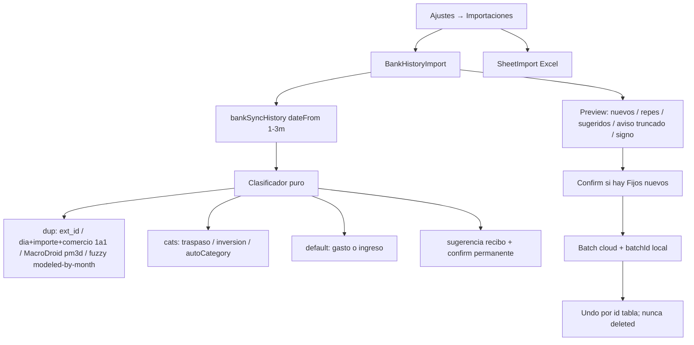

# Plan — Import histórico OB impecable

**Estado:** segunda opinión Claude (Opus max, 2026-08-05) **recibida**. Luz verde a codear **solo cuando A/B/C estén cerrados en el diseño**. Cursor implementa; Claude no toca destello.  
**Rama:** `beta` · **No tocar:** destello / `src/shell.html` / portal season / `tests/season-detalle.test.mjs`.  
**Brief origen:** [`brief-import-historico.md`](brief-import-historico.md)

---

## Decisiones cerradas (con el dueño, 2026-08-05)

- **Fijos = híbrido C:** default = **Gasto** puntual. Si casa fuzzy con un Fijo/deuda/meta ya modelado → tachar como duplicado (no importar). Si no casa → el usuario puede marcar «Recibo» a mano y crear Fijo nuevo **solo tras confirmación** («esto se restará todos los meses, también hacia atrás»).
- **Gastos = salir todo:** preview de **todos los bancos OB conectados**. Contabilidad = `expenseCountsCash` / `expenseCountsBudget` (nombres reales; **no** existe `expenseCountsForDaily`). Con `ent` bien puesto, gasto diario resta y el resto se ve como «no afecta». **No inventar otra regla. No copiar `budgetSkip`** (flag muerto hoy).
- **Misma filosofía Excel ↔ bancos:** automático en lo seguro; Fijos configurables a mano.
- **Proceso:** plan → Claude revisa → Cursor ejecuta de **uno en uno** (regla 4/8), con su veredicto entre medias. **No cherry-pick** a main; ronda glow bloquea promote.

---

## Veredicto Claude (Opus) — resumen Cursor

Arquitectura (helpers puros en `08-motor-bank.js`, UI orquesta) = **correcta, no la tocamos**.

Los 4 agujeros originales siguen reales. Opus añadió **bloqueantes** que el plan v1 no veía. **Sin cerrar A/B/C no se implementa.**

### Bloqueantes (hay que cerrarlos en el diseño antes de codear)

#### A. Undo por terna puede borrar gastos buenos

`cloud.addExpense` usa `onConflict:'user_id,fecha,importe,comercio', ignoreDuplicates:true` (`00-core.js` ~514).  
`cloud.deleteExpense` borra por la **misma terna**, no por id (~564).

Si la importación choca con un gasto que ya tenía → el upsert **no crea fila** → «Deshacer» borra el **original**. Catastrófico.

**Cierre obligatorio:**

1. Preferido: `upsert`/`insert` con `.select('id')`, guardar **ids reales de tabla** en `lastHistImport`, borrar con `.eq('id',…)`.
2. Si no es viable ya: antes de borrar por terna, comprobar que no queda otro gasto local con esa clave que **no** sea de este `batchId`; si hay ambigüedad → **no borrar nube** (solo quitar la fila local del batch) y avisar.
3. Tests: undo con terna colisionando → preexistente vive en local y **no** entra en la lista de borrados cloud.

#### B. Undo NO escribe en `state.deleted`

Los tombstones (`fecha|importe|comercio`) filtran **todo** lo que llega del pull. Un tombstone del undo deja fuera para siempre (hasta rotar 500) gastos reales con esa clave. `reconcileObDupes` ya documentó que tombstones no bastan.

**Cierre:** undo = quitar filas del batch en local + `deleteExpense` por id (o terna segura de A). **Cero** altas a `state.deleted`.

#### C. Clasificar traspasos y aportes como el sync diario

Hoy el histórico pone siempre `ingreso` / `autoCategory`. El sync diario (`importObExpenses` ~410–435):

- Ingreso: `esTraspasoPropio` → `TRASPASO_CAT`, si no → `INGRESO_CAT`.
- Gasto diario con importe ≈ `monthlyInvest` → categoría `inversion` (neutra).
- **Copiar solo la categoría.** Nunca `applyInvestBuy` (duplicaría cartera).

Sin esto: traspasos Sabadell→TR inflan ingresos; «Mi ciclo» se reancla a un traspaso; aportes destrozan presupuesto.

### Importantes (cerrar en la misma feature, no como afterthought)

| Id | Qué | Cierre |
|----|-----|--------|
| D | Nombre fantasma `expenseCountsForDaily` | Usar `expenseCountsCash` / `expenseCountsBudget` |
| E | `entFromAspsp` → `null` fuera del catálogo ENT | Ent sintético desde aspsp **o** mensaje «banco no reconocido»; nunca lista vacía muda |
| F | Servidor trunca (~12 pág / 2000 tx) | Devolver/avisar `truncated` o comparar fecha mínima vs `dateFrom` |
| G | N× `addExpense` + `.catch(()=>{})` | Batch `addExpenses(rows)` + meterlo en `CLOUD_WRITES` (`00-core.js` ~914) o security/modo pruebas rompe |
| H | `histCandExisting` mapa 1:N | Consumo **1 a 1** como `usadoDup` del sync |
| I | `matchesModeled` es del mes **actual** | Versión por mes del candidato (`occursIn`/`occAmountIn`/`debtBalloonIn`/`oneoffOccurs`) |
| J | Signo invertido por banco | Preview: totales por banco; si >~70 % «ingreso» → confirmación |
| K | e2e `bancos-historico-filtro` | **Migrar** a Importaciones, no borrar |
| L | `importBatchId` no va a la nube | Botón Deshacer solo mientras existan filas locales del batch |
| M | Fijo sin inicio/fin | Texto de confirmación: resta **todos** los meses, también hacia atrás |

### Confirmado NO tocar

- Destello / shell / portal season / `tests/season-detalle.test.mjs`
- Suelo 8 días de `importObExpenses` (sync diario ≠ histórico)
- No reintroducir syncs automáticos (AGENTS §7)
- No meter gastos en la clave principal (§7 bis)
- `budgetSkip`: no copiarlo; limpiarlo es otra tanda
- No cherry-pick a main; promote de ronda entera

---

## Problema real (evidencia original)

Hoy en `BankHistoryImport` (`src/modules/10-app-components.js`):

```js
const defDest=function(x){
  if(x.kind==="in") return "ingreso";
  if(x.card) return "gasto";
  return "recibo";  // ← crea Fijo permanente
};
```

Cuatro agujeros + botón duplicado Mis bancos / Importaciones.

---

## Arquitectura objetivo (sin cambio de forma)



**Principio:** helpers puros en `08-motor-bank.js`; UI orquesta.

API:

- `histClassifyCandidates(cands, state)` → status, reason, match, defDest, suggestRecibo, category
- `histBuildCommit(...)` → expAdds, fixAdds, batchId (no escribe)
- `histUndoBatch(state, lastHistImport)` → nextState + `{ cloudDeleteById: [...] }` (nunca `deleted`)

Commit: `source:"ob-hist"`, `ent`, categorías como sync diario, batch cloud. Undo: ids reales.

---

## Tests que exigen Opus (antes de beta)

Ampliar `tests/hist-import-dup.test.mjs`:

1. Undo con terna colisionante → preexistente vivo; no en lista de borrados nube.
2. Undo no escribe `state.deleted`.
3. Undo idempotente; sin ids locales → no-op declarado (no «✓ deshecho»).
4. Traspaso propio → `traspaso`, no `ingreso`.
5. Aporte mensual → `inversion`; `investments` intacto (no `applyInvestBuy`).
6. `matchesModeled` por mes del candidato (no solo mes actual).
7. `histCandExisting` 1:1 (2 candidatos vs 1 guardado → un solo dup).
8. Gemelo MacroDroid ±3d, 1:1.
9. Fuzzy «RECIBO ENDESA…» vs Fijo «Luz»; vs deuda; vs meta.
10. Default a ciegas → `state.fixed` intacto.
11. Banco fuera de ENT → candidatos visibles o error claro.
12. Signo sospechoso → preview lo marca.

E2e: migrar `bancos-historico-filtro` a Importaciones; ampliar `ajustes-importaciones`; Mis bancos sin botón hist.

**Y lo que ningún test ve:** simular contra su estado real de la nube antes de cantar victoria (regla 4/8).

Checklist versión: `VERSION` = package = CHANGELOG = RELEASE_NOTES = README «Estado actual» = ROADMAP (si no, `docs-frescura` falla).

---

## Orden de ejecución (uno en uno, con su OK entre tandas)

1. **Tanda motor:** helpers + tests A/B/C/H/I/J (rojo→verde) — sin UI aún.
2. **Tanda UI segura:** `BankHistoryImport` defaults, categorías, confirm Fijos, preview truncado/signo — él prueba en beta.
3. **Tanda puertas + undo:** quitar Mis bancos; allow-list; batch cloud + undo por id — él prueba deshacer con datos reales.
4. **Tanda ship:** i18n es/en/ca; e2e migrados; bump beta; NOTES/CHANGELOG/README/ROADMAP.

---

## Fuera de alcance

- Destello / season / promote glow.
- Widget, MyInvestor, Hogar, multidivisa.
- Revolut CSV inversiones en Importaciones.
- Limpiar `budgetSkip` muerto.
