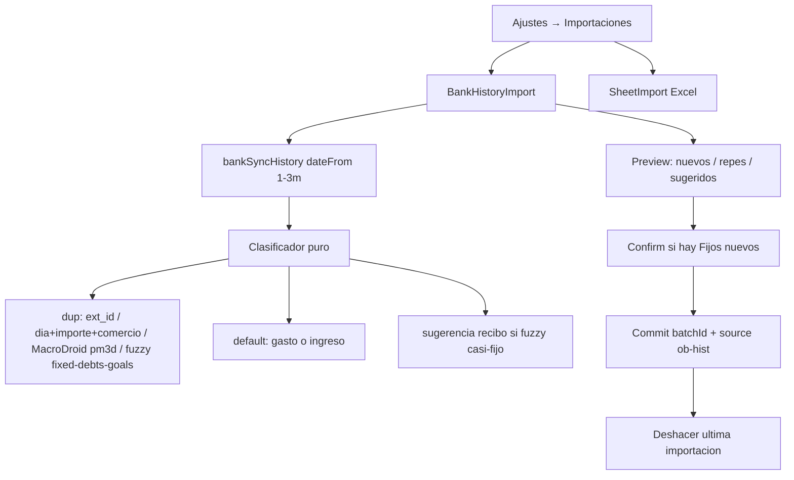

# Plan — Import histórico OB impecable

**Estado:** pendiente de segunda opinión Claude (Opus) → luego implementa Cursor.  
**Rama:** `beta` · **No tocar:** destello / `src/shell.html` / portal season / `tests/season-detalle.test.mjs`.  
**Brief origen:** [`brief-import-historico.md`](brief-import-historico.md)

---

## Decisiones cerradas (con el dueño, 2026-08-05)

- **Fijos = híbrido C:** default = **Gasto** puntual. Si casa fuzzy con un Fijo/deuda/meta ya modelado → tachar como duplicado (no importar). Si no casa → el usuario puede marcar «Recibo» a mano y crear Fijo nuevo **solo tras confirmación** («esto se restará todos los meses»).
- **Gastos = salir todo:** el preview trae movimientos de **todos los bancos OB conectados** (no solo `expenseBanks`). Al guardar como gasto/ingreso, el `ent` queda bien puesto y la contabilidad existente decide: gasto diario resta; el resto se ve en Gastos como «no afecta» (`expenseCountsForDaily` en `01-i18n.js` / pedido 2026-08-05). **No inventar otra regla.**
- **Misma filosofía Excel ↔ bancos:** automático en lo seguro; Fijos configurables a mano cuando haga falta.
- **Proceso:** Cursor deja el plan → Claude personal (Opus) revisa → Cursor ejecuta (sin pisar destello).

---

## Problema real (evidencia)

Hoy en `BankHistoryImport` (`src/modules/10-app-components.js`):

```js
const defDest=function(x){
  if(x.kind==="in") return "ingreso";
  if(x.card) return "gasto";
  return "recibo";  // ← crea Fijo permanente
};
```

Cuatro agujeros auditados (4/8) + prueba real (3/8):

1. `defDest` → "recibo" en cargos no-tarjeta → Fijo mensual permanente.
2. `fixNames` exacto (nombre+importe+cuenta) — «Luz» ≠ «RECIBO ENDESA…» → duplica.
3. No cruza `state.debts` ni metas/ahorro.
4. No hay deshacer.

Botón duplicado: Mis bancos (~L756) **y** Ajustes → Importaciones (~L2681). Él pidió: histórico **solo** en Importaciones.

---

## Arquitectura objetivo



**Principio:** toda la lógica de riesgo (dedup, destino por defecto, match fuzzy, batch undo) vive en helpers **puros** en `src/modules/08-motor-bank.js`, testeables sin React. La UI solo orquesta.

---

## Cambios concretos

### 1. UX / puertas (sin tocar destello)

- **Quitar** «Importar histórico» de `BankPanel` / Mis bancos (botón + portal `histOpen` ahí).
- **Dejar solo** Ajustes → Importaciones (`imphist`). Revolut CSV de inversiones se queda en Mis bancos (otro dominio).
- Allow-list del fetch: **enlaces OB active/pending** (todas las cuentas del payload `accounts[]`), no `expenseBankEnts`.
- Flujo tipo hoja: buscar → preview claro (nuevos / ya tienes / sugerido fijo) → confirmar → pantalla fin con **Deshacer**.
- Default destino: `in`→ingreso, resto→**gasto**. «Recibo» nunca pre-marcado salvo sugerencia explícita + confirmación al commit si hay altas a `fixed`.

### 2. Motor de seguridad (núcleo)

En `src/modules/08-motor-bank.js`, ampliar / unificar:

| Capa | Criterio |
|------|----------|
| Cierto | `ext_id` ya en expenses → ocultar o tachar silencioso |
| Misma fila | día + importe firmado + comercio NFD (como `histCandDupKey` / `hojaClave`) |
| Gemelo aviso | importe exacto ±3 días, merchant vacío/`Movimiento`, `source` MacroDroid (mismo espíritu que sync diario) |
| Modelado | reutilizar `recNameMatch` + `recAmtClose` / `matchesModeled` contra `fixed`, `debts`, oneoffs; metas/ahorro si tienen importe+nombre usable |
| Lote | `dedupeHistRecibos` solo aplica si el destino elegido es recibo (no al default gasto) |

API sugerida:

- `histClassifyCandidates(cands, state)` → por índice: `{ status, reason, match?, defDest, suggestRecibo }`
- `histBuildCommit(selected, dest, state)` → `{ expAdds, fixAdds, batchId }` (no escribe)
- `histUndoBatch(state, batchId)` → estado sin esos ids + lista cloud a borrar

Commit: `source:"ob-hist"`, `importBatchId`, `ent` correcto. Cloud: `addExpense` / al deshacer `deleteExpense` (lección TR: local solo no basta — ver `docs/memoria/tr-duplicados-saga.md`).

### 3. Deshacer

- Guardar última tanda en estado ligero (`lastHistImport: { batchId, at, expenseIds, fixedIds }`).
- Toast / pantalla fin: «Deshacer» ~10 min o hasta la siguiente importación.
- Deshacer = quitar expenses+fixed de esa tanda en local **y** nube.

### 4. Excel alineado (mínimo necesario)

- Misma filosofía de preview/repes; si el undo de lote es barato, `source:"hoja"` puede compartir `importBatchId` (mismo helper). No reescribir todo `15-import-hoja.js`: solo el gancho de batch + deshacer si encaja sin divertirse.

### 5. Tests (obligatorio antes de beta)

- Unitarios en `tests/hist-import-dup.test.mjs`: los 4 agujeros + fuzzy «Luz» vs «RECIBO ENDESA…» + debt match + default no-crea-fijo + undo idempotente.
- E2e: `e2e/ajustes-importaciones.spec.mjs` — histórico solo en Importaciones; Mis bancos sin botón.
- **No tocar** season / shell / portal glow.

### 6. Versión / canal

- Feature en **`beta`** (4.15.x o 4.16.0 — coordinar con destello; **no promote** de ronda glow hasta OK del dueño).
- `RELEASE_NOTES` es/en/ca en cristiano + `CHANGELOG` técnico.

---

## Pedido a Claude (segunda opinión — NO implementar)

Lee esto + `AGENTS.md` + `docs/briefs/brief-import-historico.md` + `BankHistoryImport` en `10-app-components.js` + dedup hist / `matchesModeled` / `recNameMatch` en `08-motor-bank.js`.

Responde con:

1. **Veredicto:** ¿el plan cuadra o se deja un agujero que pueda destrozar datos reales (pareja/padre)?
2. **Riesgos que Cursor debe cubrir en tests** (lista corta, concretos).
3. **Mejoras** al clasificador / undo / allow-list si ves algo más sólido.
4. **Qué NO tocar** confirmar (destello, suelo 8d del sync diario, etc.).

**NO implementes código.** Solo opinión. Tras tu veredicto, Cursor ajusta e implementa.

---

## Fuera de alcance

- Destello / season / `shell.html` / promote 4.15 glow.
- Widget, MyInvestor, Hogar, multidivisa crucero.
- Meter Revolut CSV de inversiones en Importaciones.

## Orden de ejecución (tras OK Claude + «adelante» del dueño)

1. Helpers puros + tests de los 4 agujeros (rojo→verde).
2. Cablear `BankHistoryImport` (defaults, confirm Fijos, batch, undo).
3. Quitar entrada Mis bancos; allow-list todos OB.
4. i18n es/en/ca; build + `npm test` + e2e importaciones.
5. Bump versión beta + NOTES/CHANGELOG; push `beta` para prueba en móvil **antes** de promote.
